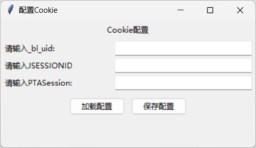
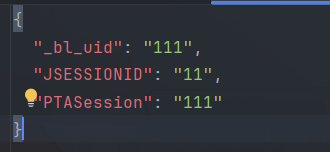
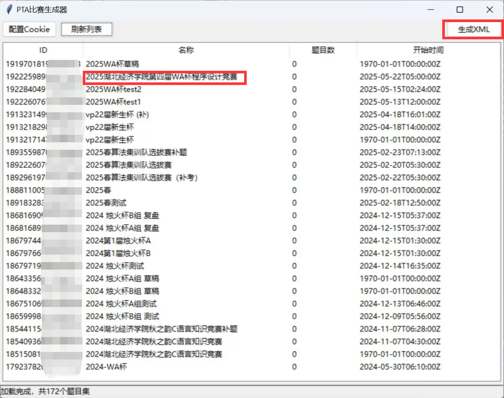

# PTA 比赛滚榜工具生成器


一款自动爬取PTA编程比赛提交记录，并生成ICPC官方滚榜工具兼容XML的解决方案


1. 启动工具之后， 会让你强制配置cookie信息(在pta界面按f12点击应用程序找到cookie一栏并复制下来即可)<br>
<br>
   (1) 保存配置 选择保存地址，会将你的cookie信息保存为json格式<br>
    <br>
   (2) 加载配置，选择保存的json格式的cookie，即可快捷完成配置
2. 加载cookie信息之后，点击刷新列表(若报错，可能是cookie信息过期，需要重新手动获取)，然后点击想要生成榜单的那场比赛再点击生成xml，即可得到resolver能识别的xml文件<br>
    

# PTA比赛生成器 使用说明

## 📌 注意事项

### 1. 账号权限要求
- **必须使用教师账号的Cookie**  
  接口基于教师端权限设计，学生账号无访问权限。使用学生账号会导致`403 Forbidden`错误。

### 2. 操作频率限制
- **避免频繁点击“刷新列表”**  
  点击一次后耐心等待加载完成，快速重复点击可能触发反爬机制，导致IP暂时封禁。

### 3. 代码修改建议
- **不要删除`headers`中的现有键值对**  
  当前`headers`已为最小必需配置，删除可能导致功能异常。如需扩展，可自行添加新字段。

### 4. 常见问题排查
- **遇到异常时优先检查Cookie有效性**  
  大部分问题（如接口无响应、数据加载失败）可能是由于Cookie过期或失效引起。重新配置Cookie后重试。

### 5. 题目集时间说明
- **未发布题目集的开始时间显示为“元年”**  
  此为默认占位符，实际发布时间需在PTA平台手动设置后才会更新。

### 6. 提交状态自定义
- **支持11种默认判题状态**  
  错误提交罚时默认为20分钟。如需扩展或修改状态类型，请按以下步骤操作：  
  1. 打开 `pta_tool_class.py` 文件；  
  2. 搜索 `judgements` 列表；  
  3. 按格式添加或修改状态键值对，例如：  
     ```python
     judgements = [
            {"id": "1", "acronym": "ACCEPTED", "name": "ACCEPTED", "solved": "true", "penalty": "false"},
            {"id": "2", "acronym": "SEGMENTATION_FAULT", "name": "SEGMENTATION_FAULT", "solved": "false","penalty": "true"},
            {"id": "3", "acronym": "WRONG_ANSWER", "name": "WRONG_ANSWER", "solved": "false", "penalty": "true"},
            {"id": "4", "acronym": "TIME_LIMIT_EXCEEDED", "name": "TIME_LIMIT_EXCEEDED", "solved": "false","penalty": "true"},
            {"id": "5", "acronym": "COMPILE_ERROR", "name": "COMPILE_ERROR", "solved": "false", "penalty": "false"},
            {"id": "6", "acronym": "FLOAT_POINT_EXCEPTION", "name": "FLOAT_POINT_EXCEPTION", "solved": "false","penalty": "true"},
            {"id": "7", "acronym": "MEMORY_LIMIT_EXCEEDED", "name": "MEMORY_LIMIT_EXCEEDED", "solved": "false","penalty": "true"},
            {"id": "8", "acronym": "NON_ZERO_EXIT_CODE", "name": "NON_ZERO_EXIT_CODE", "solved": "false","penalty": "true"},
            {"id": "9", "acronym": "RUNTIME_ERROR", "name": "RUNTIME_ERROR", "solved": "false", "penalty": "true"},
            {"id": "10", "acronym": "PRESENTATION_ERROR", "name": "PRESENTATION_ERROR", "solved": "false","penalty": "true"},
            {"id": "11", "acronym": "OUTPUT_LIMIT_EXCEEDED", "name": "OUTPUT_LIMIT_EXCEEDED", "solved": "false","penalty": "true"}
        ]
     ```

---

## 🛠️ 基础使用流程

1. **配置Cookie**  
   - 首次运行需通过“配置Cookie”按钮输入教师账号的Cookie信息。
   - 支持从JSON文件加载或手动输入后保存配置。

2. **加载题目集**  
   - 点击“刷新列表”加载账号下的所有题目集（仅需点击一次）。

3. **生成比赛XML**  
   - 从列表中选择题目集，点击“生成XML”导出为标准格式文件。

---

## ❓ 反馈与支持  
如遇问题，请提交Issue并附上：  
- 错误截图  
- 操作步骤描述  
